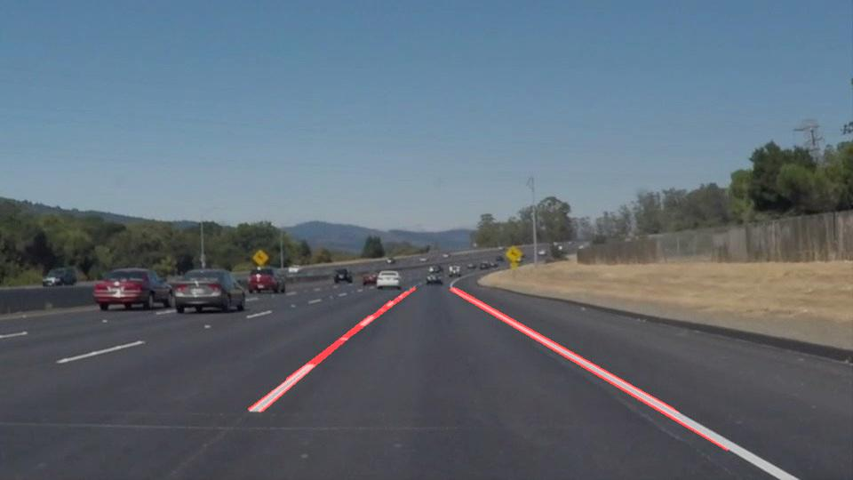

# **Finding Lane Lines on the Road**

---

**Finding Lane Lines on the Road**

The goals / steps of this project are the following:
* Make a pipeline that finds lane lines on the road
* Reflect on your work in a written report

---

### Reflection

### 1. Describe your pipeline. As part of the description, explain how you modified the draw_lines() function.

My pipeline consisted of 6 steps :

0. Original Image

1. Grayscale transform Image

2. Gaussian Blur the gray image with a kernel size of 7.

3. Canny Detection Edges with a low threshold of 50 and high threshold of 150.

4. Masked the edges with a polygons of 4 vertices defined by 6 ratios variables (left bottom, right bottom, left top, right bottom, top and bottom).  I added default parameters to the process image function for being able to adjust the mask specially for third video (challenge video).

5. Hough Transformation is apply on the masked edges image and we generate an  image with these lines.  Best parameters for this transform was a RHO(2), THETA(1 degress = PI/180), THRESHOLD(35), MIN LINE LEN(50), MAX LINE GAP (150).  These parameters was found with testing the samples images and I have also isolated some problematic frames of the videos for fine tuning the THRESHOLD value.

6) The last step is a weighted merge of the original image with the draw lines image generated.

In order to draw the single line on the left and right lanes, I modified the draw_lines function with these steps :
1. Using formula f(x) = mx + b, compute the slope(m) and y-axis intercept point (b) for each lines.
2. Excluding line with an infinite slope.
3. Sorting the lines between left and right lanes based on the slope(m) value.
4. Average all the slopes and y-axis intercept points.
5. Compute (f(x) = mx + b) and draw two lines based on the averages values from the bottom to the top coordinate define by a top ratio parameter.

### 2. Identify potential shortcomings with your current pipeline

One potential shortcoming would be what would happen when the camera is not fixed in a central position.  Another shortcoming, the pipeline work well with straight road on flat ground but not so much with curves road we need to adjust the area of interest mask and shorten the lane detection.

Finally it could be also difficult to detect edge with big variation of light conditions.  We see this problem with the challenge video, the shadow areas generate a lot of issues.

### 3. Suggest possible improvements to your pipeline

A possible improvement could be to have more image processing steps (changing the colourspace, adjusting the contrast, etc...) for reducing the artefacts generated by light conditions and shadow.

Another potential improvement could be to add lane type detection for dealing with multi lane path on some highways.
